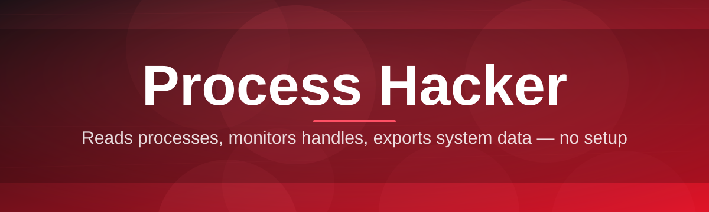

# process-config-editor 🧬⚙️

  

*Rewire how you see, shape, and steer every process on your machine — no fluff, no fillers.*

  

---

## 🔬 Overview

`process-config-editor` is a configuration and inspection layer built for people who treat **Process Hacker** as their default lens on Windows internals. Task Manager tells you a name and a number. This tool tells you the story — handles, threads, memory maps, service dependencies, and the exact configuration profile driving each process — then lets you edit that profile without wrestling raw registry paths or brittle `.ini` files by hand.

It exists because process-level visibility tools are usually split into two camps: heavyweight kernel debuggers built for specialists, or toy monitors that only show CPU percentages. Neither camp lets you actually *save and reuse* a configuration — priority rules, affinity masks, watch-lists, alert thresholds — as a portable profile. This project closes that gap by treating process configuration as a first-class, versioned artifact instead of a one-off tweak you forget by next reboot.

Built for sysadmins auditing rogue services, reverse engineers mapping unfamiliar binaries, power users tired of re-setting process priorities every session, and support engineers who need a repeatable Process Hacker setup across a whole fleet of machines. If you've ever muttered "why did I have to redo this again," this is the readme you were looking for.

> [!TIP]
> Skip the reading. Three steps: **1)** open the landing page above **2)** download the standalone build **3)** run it — no installer, no reboot, no dependency chase.

---

## 🧩 What It Actually Does

| Capability | Why It Matters |
|---|---|
| **Profile-based process tuning** | Save priority, affinity, and I/O priority as a named profile — apply it to any matching process instantly, forever. |
| **Live handle & module inspector** | Walk open handles, loaded modules, and mapped sections without a debugger attached, rendered in a readable tree. |
| **Service dependency mapper** | Visualize which services spawn, depend on, or restart which processes — untangle startup chaos in seconds. |
| **Threshold-based alerting** | Configure memory/CPU/handle-count thresholds per profile; get flagged before a leak becomes an incident. |
| **Config diffing** | Compare two exported configuration snapshots side-by-side to spot what silently changed between reboots. |
| **Portable JSON profiles** | Every configuration exports to a single readable JSON file — version it, share it, diff it in any editor. |
| **Watch-list groups** | Cluster related processes (e.g. all Node workers, all render nodes) and apply bulk config changes at once. |
| **Startup impact scoring** | Ranks processes by real startup-time cost, not just presence in the startup folder. |

> [!NOTE]
> Nothing here modifies kernel structures directly. Configuration edits are applied through documented Windows APIs — this is a controller, not a rootkit.

---

## 🚀 Getting Off The Ground

1. Visit the landing page via the download button above.

2. Grab the standalone `.exe` — no installer wizard, no bundled toolbar.

3. Double-click to run. Windows may show a SmartScreen prompt for unsigned binaries — click **More info → Run anyway**.

4. On first launch, the setup wizard scans running processes and offers to import a default config baseline.

> [!IMPORTANT]
> Run as Administrator if you intend to edit priority/affinity on system or service processes. Standard user rights only expose read-only inspection.

---

## 🖥️ System Requirements

| Component | Requirement |
|---|---|
| OS | Windows 10 (1903+) or Windows 11 |
| Architecture | x64 (ARM64 via emulation, unverified) |
| RAM | 200 MB free at runtime |
| Disk | ~40 MB, zero install footprint |
| Dependencies | None — statically linked, no runtime to fetch |
| Privileges | Standard user for viewing, Administrator for system-level edits |

  

---

## ⚙️ How It Works

The pipeline is intentionally shallow — fewer moving parts, fewer surprises:

1. **Enumerate** — a snapshot pass walks the process table via documented NT APIs.

2. **Resolve** — each process is matched against saved profiles by name, path, or hash.

3. **Apply** — matching configuration (priority, affinity, alerts) gets pushed live.

4. **Observe** — a background watcher re-checks thresholds on a configurable interval.

5. **Persist** — any manual change you make can be saved back into the profile for next time.

---

## 🩹 Troubleshooting

<strong>Process Hacker-style tools flag this app as suspicious — is that expected?</strong>

Yes. Any tool that reads handles, threads, and module lists across process boundaries trips heuristic AV flags. It's unsigned by design to stay lightweight — check the hash on the landing page if you want certainty.

<strong>My priority/affinity edits revert after a few seconds.</strong>

Another process (often a game launcher or security suite) is re-asserting its own priority. Add it to a watch-list group with a higher-priority profile so the editor re-applies faster than it gets overridden.

<strong>Service dependency map shows a process with no visible parent.</strong>

That's typically a detached child re-parented to `svchost.exe` after its original launcher exited. Normal Windows behavior, not a bug in the mapper.

<strong>Config diff shows changes I never made.</strong>

Windows Update or a driver install can silently rewrite affinity masks on reboot. Re-apply your saved profile — that's exactly the scenario profiles exist for.

<strong>The app won't elevate even after "Run as Administrator."</strong>

Check for a pending UAC prompt hidden behind another window, or a Group Policy blocking elevation for unsigned binaries. Signed builds are on the roadmap.

> [!WARNING]
> Editing affinity/priority on core system processes (`csrss.exe`, `wininit.exe`, etc.) can destabilize the OS. The editor will warn you — read the warning.

---

## 🎨 UI / UX Notes

| Shortcut | Action |
|---|---|
| `Ctrl+F` | Focus process search |
| `Ctrl+S` | Save current profile |
| `Ctrl+D` | Diff two loaded configs |
| `F5` | Force re-enumerate processes |
| `Alt+P` | Toggle priority-edit panel |
| `Ctrl+Shift+A` | Bulk-apply profile to watch-list group |

* **Themes:** Dark (default), Light, and a high-contrast mode for accessibility.

* **Settings** persist to a local JSON file — no cloud sync, no telemetry phone-home.

* Layout is dockable: pin the module inspector, detach the alert panel, arrange it like your actual debugging habit.

> [!TIP]
> Pin the watch-list panel to the left dock — it's the fastest way to eyeball drift across a whole process group at a glance.

---

## 🤝 Contributing & Community

Issues, feature requests, and pull requests are welcome. Before opening a PR:

* Keep changes scoped — one feature or fix per PR, not a grab-bag.

* Include a before/after description for any UI change — screenshots help reviewers move fast.

* Discussion threads live in the repo's **Discussions** tab for design proposals; **Issues** is strictly for bugs and concrete requests.

> [!NOTE]
> This project is community-maintained. Response times vary — patience is a contribution too.

---

## 📜 License

Released under the [MIT License](LICENSE), 2026. Use it, fork it, ship it in your own toolkit — just keep the license notice intact.

---

## ⚠️ Disclaimer

This tool inspects and configures processes using documented, publicly available Windows APIs. It is provided **as-is**, without warranty of any kind. You are responsible for how you use it, particularly when editing system-level process behavior — misconfiguration can affect system stability. Not affiliated with any official Process Hacker maintainers or Microsoft.

